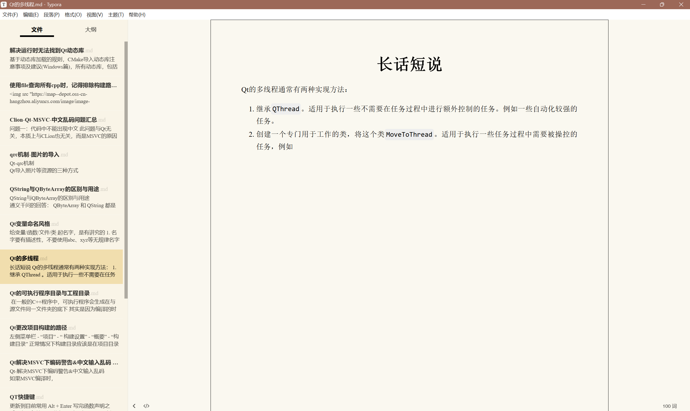
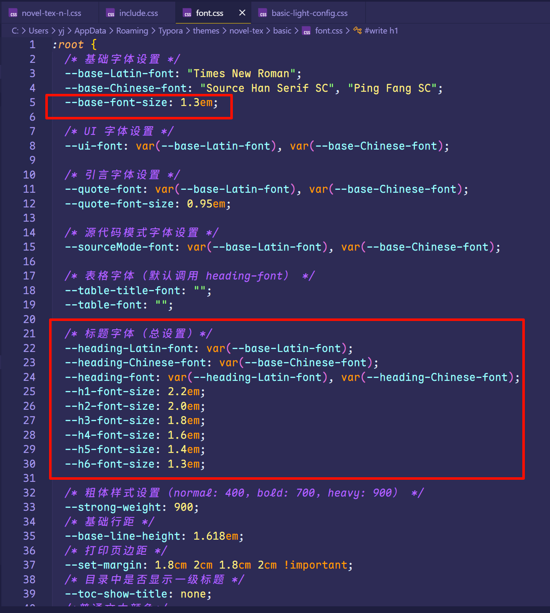
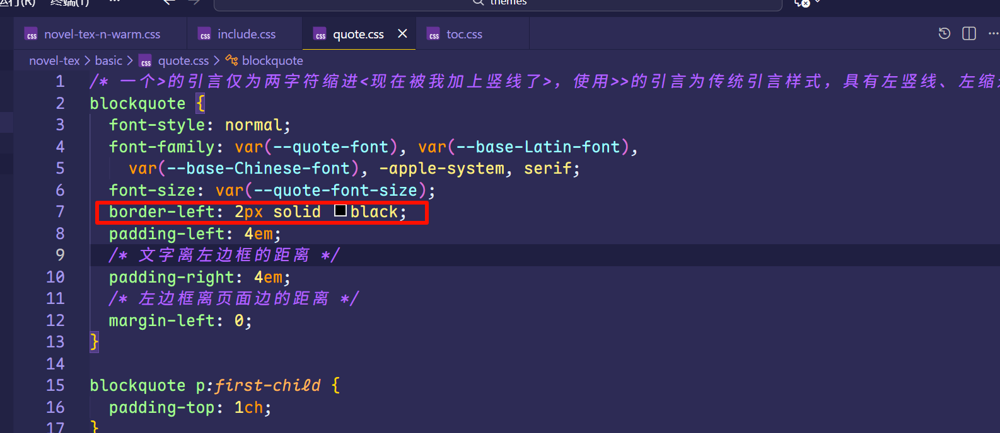
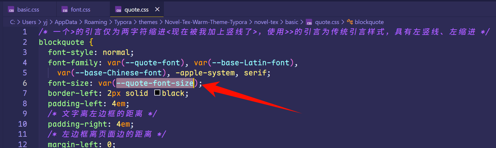
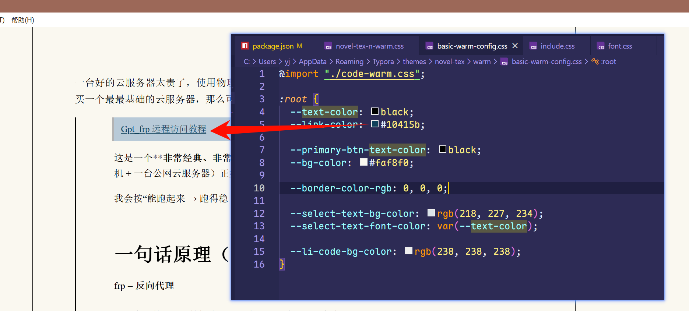
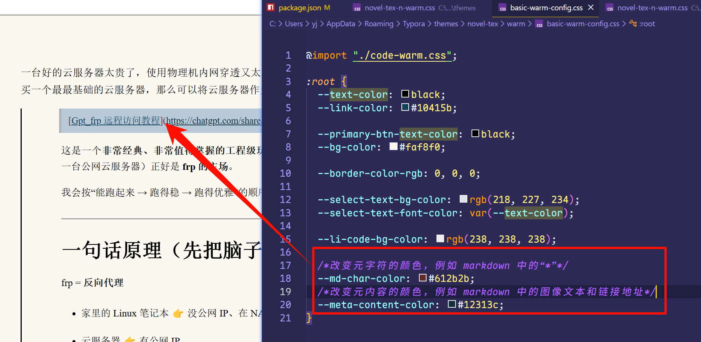

> 基于[【Novel Tex】](https://github.com/soryu-ryouji/novel-tex-theme)新增warm主题，且修改字体大小以适配低分辨率屏幕，解决锯齿问题

## 修改记录

#### 2025-12-9

基于Novel-Tex-N-L主题，创建Novel-Tex-N-Warm主题，修改基础主题的字体、背景等。

 增加字体大小，主要解决低分屏下宋体锯齿问题

 修改>时竖线不显示问题

   增加>中字体大小，主要解决低分屏下宋体锯齿问题

 修改warm主题下超链接颜色不突出的问题

 修改warm主题下元符号颜色不突出的问题

